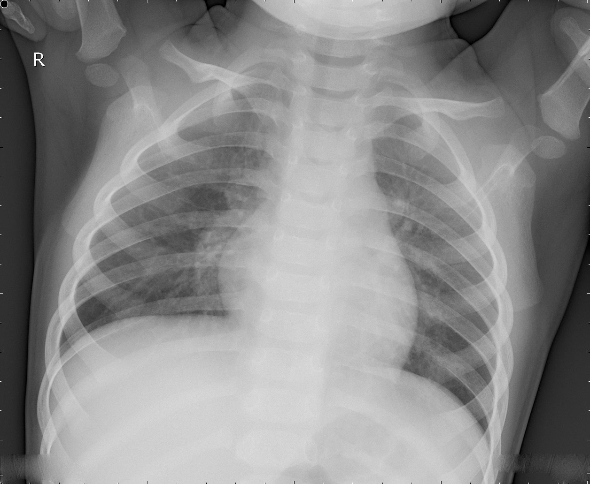
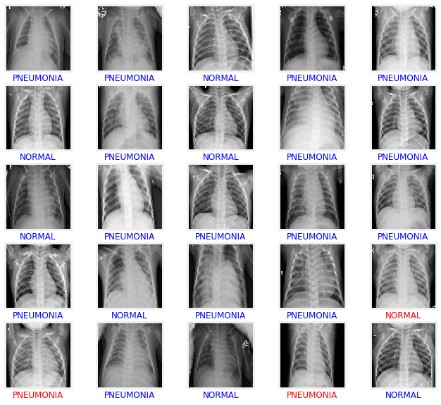

# 🩺 Pneumonia Detection using Deep Learning

## 📌 Project Overview
This project utilizes deep learning to detect pneumonia from chest X-ray images. A **Convolutional Neural Network (CNN)** is trained on medical image data to classify images as either **"PNEUMONIA"** or **"NORMAL."**

---

## 📂 Dataset Description
The dataset is sourced from the **Chest X-Ray dataset**. It consists of three folders:

📁 **train/** - Training images  
📁 **test/** - Testing images  
📁 **val/** - Validation images  

Each folder contains two subdirectories:

✅ **NORMAL/** - Chest X-rays without pneumonia  
❌ **PNEUMONIA/** - Chest X-rays with pneumonia  

### 🖼 Sample Images



## ⚙️ Installation Requirements
Ensure you have the following libraries installed:
```bash
pip install tensorflow numpy pandas matplotlib seaborn opencv-python
```


## 🚀 Usage Instructions

### 🔹 Run the notebook:
```bash
jupyter notebook pneumonia-detection.ipynb
```
### 🔹 Train the model and evaluate the results.

---

## 🏗 Model Training & Evaluation
- **🛠 Preprocessing:** Images are resized to **200x200 pixels**.  
- **📈 Augmentation:** `ImageDataGenerator` is used for data augmentation.  
- **🏗 Model Architecture:** A CNN with **Conv2D, MaxPooling, Dropout, and Dense layers**.  
- **⚡ Optimization:** `Adam` optimizer with **categorical cross-entropy loss**.  

---

## 📥 Input & 📤 Output Example
### 🔹 Input Image


### 🔹 Model Prediction
```python
pred = model.predict(img)
print("Prediction:", labels[np.argmax(pred)])
```
### 🔹 Output Image


---

---

## 📊 Confusion Matrix & Performance Metrics
✅ **Accuracy:** 98%  
✅ **Precision:** 0.97  
✅ **Recall:** 0.99  

### 🔹 Confusion Matrix


---

## 🎯 Results & Conclusion
The trained CNN model achieves **high accuracy** in detecting pneumonia from chest X-ray images, demonstrating its potential in **medical imaging applications**. Further improvements can be made using **more complex architectures or transfer learning**.

---

## 👨‍💻 Author
**📌 K. Pavan Kumar**

